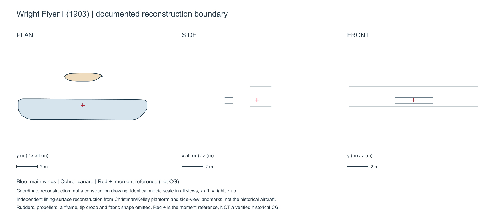
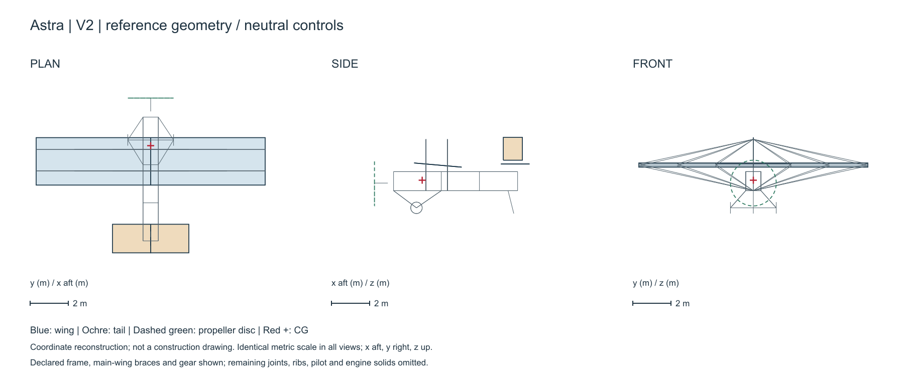
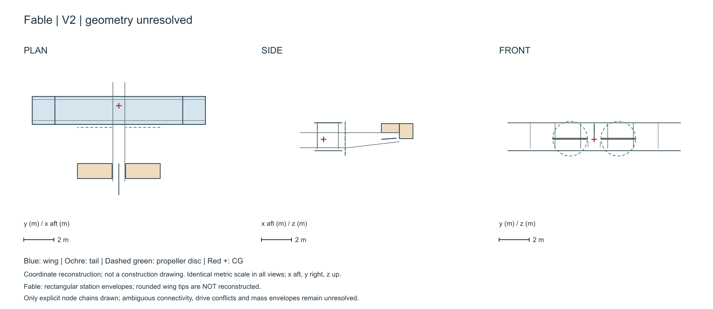
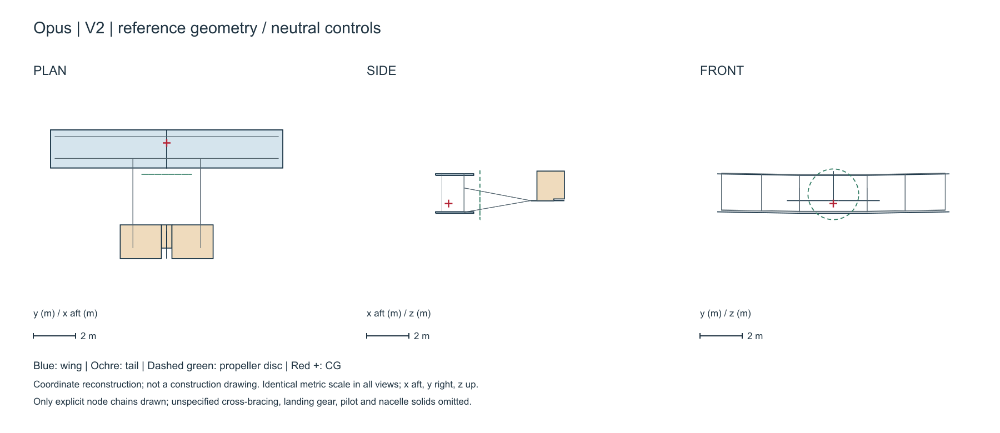

# Historical aircraft design with language models

## Latest public update: 2 October 2026, draft27 / V16

Start with the [current manuscript and evidence guide](releases/draft27/README.md),
[67-page reading PDF](releases/draft27/manuscript/main.pdf), or
[83-page review PDF](releases/draft27/manuscript/main_joa_review.pdf).
The [curated source/evidence ZIP](aircraft_complete_labeled_draft27_public.zip)
has a [SHA-256 checksum](aircraft_complete_labeled_draft27_public.zip.sha256).

This additive update includes complete received V14/V15 responses, all three
completed V16 responses, selected incomplete attempts, eight-case Fable surface
trim, speed/power sensitivity, propeller audits and readable component labels.
See the guide for exact scope and reproduction limitations. **No design has
demonstrated flight capability.** Engine targets, installed trim, structural
adequacy and full dynamic modes remain unverified. Publication/submission status
is not asserted here.

The dated sections below are historical snapshots. Their `FROZEN_UNSENT` V14
status and statements about missing PDF proof apply to those older releases,
not the new draft27 package. The old `research_evidence.zip` is still R5.

**Author: Ehsan Roohi**

Versioned research on three aircraft proposals produced under a documentary cutoff of **31 December 1898**, followed by clarification, independent evaluation and model revision. The model identifiers in the archived runs are `gpt-6-astra`, `claude-fable-5-1` and `claude-opus-5-5`.

The cutoff constrains supplied documents, not the models' training knowledge. Modern evaluator feedback is distinguished from the historical input packet. This repository is a work-in-progress research record, not a journal acceptance or a build/flight authorization.

## 29 September 2026 G8 figure-readability draft

The fixed tag `aircraft-joa-2026-09-29-g8-draft` adds three numbered,
enlarged V0 mechanism details and [Overleaf draft 17](aircraft_joa_overleaf_draft17.zip).
These are researcher-created display crops of the unchanged model-authored
SVGs, not design revisions. Eight markers per aircraft have readable keys in
the supplement, while the complete original V0 plates remain available.
The G8 manuscript and ZIP remain **research drafts**: no TeX/PDF proof,
verified installed propulsion, full trim, dynamic modes or flight claim.
V14 remains `FROZEN_UNSENT`. The G7 archive below remains immutable.

## 29 September 2026 earlier G7 Journal of Aircraft research draft

The fixed draft tag `aircraft-joa-2026-09-29-g7-draft` contains the
[Journal of Aircraft manuscript](paper/article_journal_of_aircraft.tex),
[Overleaf ZIP](aircraft_joa_overleaf_draft15.zip), all three frozen
[V14 feedback prompts](v14_integrated_candidate_attempt01/manifest.json),
their complete V12/V13 parents, and independent [ground](analysis/results/v14_rigid_ground_gate01.json),
[clearance](analysis/results/v14_static_clearance_budget01.json),
[centroid-inertia](analysis/results/v14_inertia_lower_bounds01.json) and
[Fable power--mass](analysis/results/v14_fable_power_fixed_point01.json)
screens. V14 is **FROZEN_UNSENT**, not a completed model run. Figure-source
SVGs and renderers are directly available, and the supplement provides
readable component keys for the dense original V0 plates. The 40-reference
manuscript and ZIP are review drafts: neither TeX compilation nor full
reference/image-rights verification, installed propulsion, complete trim,
dynamic modes or flight has been established. This tag is a research archive,
**not** a submission-ready or flight-approved release. The older G6 and R5
records remain unchanged.

## 28 September 2026 earlier G6 research record

The current [V12/V13 installation gate](paper/v12_v13_installation_gate01.md)
and [updated manuscript](paper/article_scientific_reports.tex) are frozen at
tag `aircraft-ast-2026-09-28-g6`. The [Overleaf review package](aircraft_ast_overleaf_release09.zip)
contains the main text, supplement, figures and selected audits. Astra V12
remains HOLD without a member-resolved installation. Fable V13 closes its
354.3 kg mass ledger and eight loading states, but its retained 19.5 kW
engine-side target is 0.520 kW below its own worst-case 15% reserve once
assumed drive loss is included. Opus's first V12 answer was truncated; its
separate complete replay gives a 340.3 kg analytical installation whose
selected rigid-contact arithmetic closes. Neither engine target has been
measured; matched propeller maps, loaded clearances, powered/glide trim,
dynamic modes and structural limits are missing. **No design is yet shown to
fly.** Full prompts, raw responses (including the truncation), hashes,
analysis code and gate JSON are directly browsable at G6. The earlier R5
evidence ZIP is unchanged and does not contain these newer files.

## Earlier G5 research record

The V11 manuscript and [V11 design-candidate gate](paper/v11_design_candidate_gate01.md)
are at fixed tag `aircraft-ast-2026-09-28-g5`. The earlier
[Overleaf package](aircraft_ast_overleaf_release08.zip) includes the main
article, supplement, figures, and selected audit data. The paper is a
research draft, **not a demonstrated flight-capable design or a submitted
article**. The new feedback was run with full V3/V10 context after an
initial, retained prompt that omitted it. [The provenance audit](analysis/results/v11_feedback_audit01.json)
checks all six outputs; [the engineering arithmetic screen](analysis/results/v11b_engineering_gate01.json)
finds one conditional Fable seat/gear candidate and Astra/Opus HOLDs. No
installed power, loaded clearances, whole-aircraft trim, complete dynamic
modes, structural adequacy or flight has been validated.

The `research_evidence.zip` and `MANIFEST.json` below are the older R5
snapshot. V10--V11b additions are individually browsable at G5 and are not
misrepresented as contained in that ZIP.

## Earlier R5 manuscript and fixed research snapshot

The [revised Scientific Reports-targeted source](paper/article_scientific_reports.tex), [supplement](paper/supplementary_scientific_reports.tex), [Data Availability inventory](paper/DATA_AVAILABILITY.md), and [latest Overleaf ZIP](scientific_reports_aircraft_overleaf_release07.zip) accompany the fixed tag `aircraft-sr-2026-09-28-r5`. The paper distinguishes Astra/Opus independent V2 force and moment balances from Fable's unverified model claim in a [three-case force plate](figures/v2_force_moment_comparison.png). Table 2 is explicitly V1. The two-mesh quasi-steady screen reports [fine](analysis/results/v2_rate_derivatives/fine.json) and [coarse](analysis/results/v2_rate_derivatives/coarse.json) pitch-rate derivatives for Astra and Opus; the first failed memory-allocation attempt is preserved. A [new dynamic gate](analysis/results/v2_dynamic_gate01.json) checks only the signs of a deliberately reduced two-state pitch model. Angle-of-attack-rate derivatives and installed-aircraft eigenmodes remain unresolved.

The R5 `research_evidence.zip` snapshot contains **all locally recovered through R5** prompts, responses, model attempts, code, figures, and selected numerical records in its stated scope. Its 2,852 paths have per-file SHA-256 hashes in [MANIFEST.json](MANIFEST.json); the ZIP checksum is in [research_evidence.zip.sha256](research_evidence.zip.sha256). Later direct files are outside this ZIP. The archive does not claim recovery of unrecorded service-side transport or include third-party lecture/book PDFs. No DOI has been assigned.

The [integrated flight-dynamics redesign plan](paper/dynamic_design_next_loop.md) specifies the missing inertia, unsteady derivatives, full longitudinal/lateral modes and control/propulsion gates. [Case-specific prompts](analysis/prompts_v9_integrated_dynamics/manifest.json) were submitted to Astra, Fable and Opus as Unity array `65007436`. The complete V9/V3 answers and their separate retries are now archived and audited below. These modern-feedback requests do not alter the original information-cutoff experiment.

The [V1/V2 pitch comparison](analysis/results/v1_v2_pitch_gate_comparison01.json) adds the original-design rate-derivative run. Astra V1 has a destabilizing static pitch slope but passes only the simplified two-state sign test; this is not a full dynamic verdict. Opus V1 also passes that narrow sign test, and Fable has no mechanically admissible independently evaluated trim. The V1 run is single-mesh and is not a physical stability measurement.

## Current result

**The fourth comparator is the original 1903 Wright Flyer I.** Its documented historical flight is distinct from our incomplete numerical reconstruction. The [four-aircraft comparison](paper/four_aircraft_comparison.md) includes dimensional Wright loads, pitch-slope calculations and discussion of configuration, structure, controls and propulsion. [Machine-readable comparison](analysis/results/four_aircraft_comparison01/summary.json).

Independent simplified longitudinal trim was found for Astra and Opus V2. This does **not** demonstrate real flight, complete stability, structural adequacy, engine capability, or superiority over the Wright Flyer. Fable V2 remains geometrically unresolved. See the [trim assessment](paper/v2_trim_assessment.md) and [stage register](paper/stage_registry.md).

The later integrated V3 feedback produced complete model-authored responses for all three systems. Astra finished on the first call; Fable and Opus needed separately archived high-token retries after their initial responses were cut off. [Independent provenance and mass-bookkeeping checks](paper/v9_integrated_response_gate.md) close the three declared mass ledgers and Fable's *assumed* nominal force/moment sums. None has a verified installed trim, full dynamic modes, or flight clearance. The V3 coordinate schedules are not yet independently geometry-gated three-view drawings; the V2 sheets below remain the latest rendered versions.

The subsequent [V3 geometry/loading gate](paper/v3_geometry_loading_gate01.md) and [reproducible audit](analysis/audit_v3_geometry_loading.py) add nominal area/clearance checks, independent pilot/fuel loading cases and necessary vertical-force coefficients. Fable's quoted 65/85 kg CG percentages do not match its own ledger; Opus's 13-degree ventral-fin clearance depends on whether the aft skid or wheel is the active pivot. These are not complete swept-CAD, aerodynamic trim or flight results. The new gate files are directly browsable in this repository; the fixed `research_evidence.zip` remains the preceding r5 snapshot and does not contain this later gate.

The [V3 power-necessity audit](paper/v3_power_necessity_gate01.md) finds only 86 W of conditional high-drag target margin for Astra, a 10.7/11.076 kW internal requirement discrepancy for Fable, and a 0.7 kW high-drag target shortfall for Opus. A [V10 targeted feedback round](paper/v10_response_gate01.md) first returned complete Fable and Opus correction patches; their source hashes and selected arithmetic were checked with [the V10 audit](analysis/audit_v10_responses.py). Astra's first call and one reviewed lower-token retry produced no response, with the latter recording an API `credit_balance_exhausted` error. After a same-credential billing probe succeeded, a separately archived [post-billing Astra V10 response](paper/v10_astra_postbilling_gate01.md) completed as Unity job 65012338. [Its audit](analysis/results/v10_astra_postbilling_audit01.json) verifies source provenance and selected mass, swept-radius and power arithmetic. Astra adopts **no physical component change** and supplies no installed trim or stable modes. These returns are modern researcher-assisted proposals, not aircraft demonstrated capable of flight. The new code, prompts, outcomes and reports are directly browsable; the older fixed `research_evidence.zip` does not include them.

## Three-view sheets

These are coordinate-based engineering schematics, not photorealistic illustrations or construction drawings. Unspecified parts are omitted and disclosed. V1 shows evaluator lifting surfaces; V2 adds declared structural chains, fins and propeller discs. Reference geometry is shown at neutral controls; numerical trim settings are recorded separately.

| Model | V1 | V2 |
|---|---|---|
| Astra | [Three views](output/stage_threeviews/V1/gpt-6-astra.svg) | [Three views](output/stage_threeviews/V2/gpt-6-astra.svg) |
| Fable | [Three views](output/stage_threeviews/V1/claude-fable-5-1.svg) | [Unresolved geometry](output/stage_threeviews/V2/claude-fable-5-1.svg) |
| Opus | [Three views](output/stage_threeviews/V1/claude-opus-5-5.svg) | [Three views](output/stage_threeviews/V2/claude-opus-5-5.svg) |
| Wright Flyer I (1903) | [Reference three views](output/stage_threeviews/Wright/wright-flyer-1903.svg) | Historical comparator, not an LLM revision |







## Evidence and reproducibility

[Download the R5 selected research evidence](research_evidence.zip) and verify its individual files against [MANIFEST.json](MANIFEST.json). Extract at the repository root to restore the recorded paths. That fixed archive includes original V0 drawings, recovered prompts, V1/V2/V3 responses (including the token-truncated attempts and completed retries), local analysis code, numerical inputs/outputs, rejected/failed attempts and dated methodological notes. Later V10--V11b code, prompts, outputs and reports are directly browsable at G5, outside the R5 ZIP. The archived original responses remain unchanged. Earlier notes may be superseded; consult the stage register for current status.

Python 3 with NumPy is required for the current calculations and vector drawings. To reproduce the drawings after extracting the evidence:

```sh
python analysis/draw_stage_threeviews.py
python -m unittest discover -s analysis -p test_stage_threeviews.py
python analysis/v2_trim_report.py
python analysis/wright_fourway_assessment.py
python analysis/audit_v9_integrated_responses.py
```

The optional Node preview renderer uses Sharp; its current local dependency path is host-specific and must be adapted on another machine. SVGs remain portable vector masters. AVL 3.52 is not redistributed; obtain it separately and set the executable path in the analysis code. Numerical run scripts use exclusive output-directory creation to protect archived runs: choose new output paths rather than overwriting results. Cross-platform solver reproduction is not yet verified.

The Wright sheet depicts reconstructed lifting surfaces, not complete rudder/propeller/airframe geometry. Its red cross marks a moment reference, **not a verified historical CG**. The approximately -22% slope descriptor therefore must not be quoted as the Flyer's established static margin. Positive AI local slope ratios are not proof of superiority over the Flyer.

## Constraints and exclusions

Unknown geometry, drag components, engine curves, material allowables and inertias are explicitly recorded rather than filled with unmarked assumptions. The trim report distinguishes aerodynamic restoring slopes from complete powered-aircraft static margins. No occupied testing is authorized by this work.

Books (including Roskam and Malaek scans), downloaded journal PDFs, personal files, credentials, temporary folders and solver executables are excluded. No general reuse license has yet been assigned; public visibility does not imply unrestricted reuse. Source attribution and rights remain attached to the relevant records.
